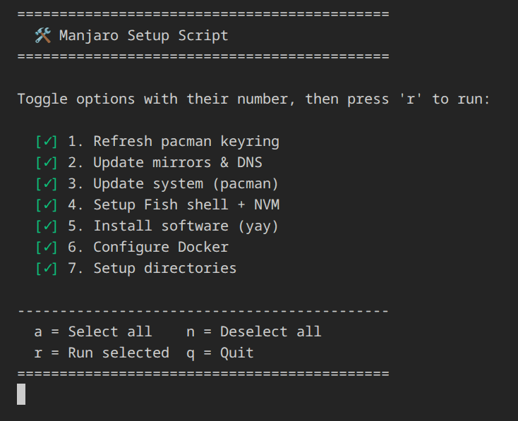

# Auto Backup

Backup and restore tools for a fresh Manjaro/Arch Linux install.

## What it backs up

- **Fish Shell** - history and config
- **Brave Browser** - bookmarks, history
- **Cursor IDE** - settings, keybindings, snippets, extensions
- **Konsole Terminal** - config and profiles

## Setup

```bash
# Install dependencies
pip install -r requirements.txt

# Configure environment
cp env.example .env
```

Edit `.env`:

```env
BACKUP_FOLDER_PATH=/path/to/local/backup
GOOGLE_DRIVE_FOLDER_ID=your_folder_id
GOOGLE_CREDENTIALS_FILE=google-creds.json
GOOGLE_TOKEN_FILE=google-token.json
```

### Google Drive Setup

1. Go to [Google Cloud Console](https://console.cloud.google.com/)
2. Create project → Enable **Google Drive API**
3. Create OAuth 2.0 credentials (Desktop app)
4. Download and save as `google-creds.json`

## Usage

### Backup (current machine)

```bash
python src/main.py
```

This will:

1. Extract Fish data
2. Extract Brave bookmarks
3. Extract Cursor settings
4. Upload to Google Drive

### Restore (fresh install)

```bash
python src/restore.py
```

This will:

1. Install packages (`src/packages/install_packages.sh`)
2. Download backup from Google Drive
3. Restore Fish data
4. Restore Brave bookmarks
5. Restore Cursor settings
6. Restore Konsole terminal

### Package Installer

Interactive menu to select which steps to run:



## Project Structure

```
auto-backup/
├── src/
│   ├── main.py              # Backup entry point
│   ├── restore.py           # Restore entry point
│   ├── backup_to_drive.py   # Google Drive upload
│   ├── modules/
│   │   ├── fish/
│   │   │   ├── extract.py
│   │   │   └── restore.py
│   │   ├── brave/
│   │   │   ├── extract.py
│   │   │   └── restore.py
│   │   ├── cursor/
│   │   │   ├── extract.py
│   │   │   ├── restore.py
│   │   │   └── command.py
│   │   └── konsole/
│   │       ├── extract.py
│   │       └── restore.py
│   └── packages/
│       └── install_packages.sh
├── requirements.txt
├── .env
└── google-creds.json
```

## Cron (automated backup)

```bash
# Daily backup at 2 AM
0 2 * * * cd /path/to/auto-backup && python src/main.py >> backup.log 2>&1
```
